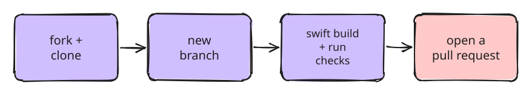
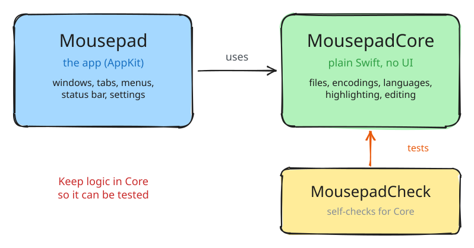

#  Mousepad for macOS

**[Install](#install) · [Features](#features) · [Shortcuts](#shortcuts) · [Contributing](#contributing)**

[](https://github.com/code-zenx/homebrew-mousepad/releases/latest)


A small, fast text editor for the Mac. It is [Xfce's Mousepad](https://docs.xfce.org/apps/mousepad/start)
rebuilt in Swift and AppKit, with no dependencies.

It opens a 20 MB file in under a second and starts instantly.


## Install

```sh
brew tap code-zenx/mousepad
brew trust code-zenx/mousepad
brew install --cask mousepad
```

`brew trust` is needed by Homebrew 6 for any third-party tap. Undo it with `brew untrust`.

Or download `Mousepad.zip` from [Releases](https://github.com/code-zenx/homebrew-mousepad/releases/latest),
move the app to Applications, and run this once so macOS lets it open:

```sh
xattr -dr com.apple.quarantine /Applications/Mousepad.app
```

## Requirements

- macOS 14 (Sonoma) or newer
- Apple silicon for the download. Intel Macs can [build from source](#contributing).

## Features

- **Tabs** in one window. `*` marks unsaved tabs, middle-click closes one.
- **Syntax highlighting** for 16 languages, picked by file name or shebang.
- **Big files stay fast.** Only the part on screen gets highlighted.
- **Encodings kept as they are:** UTF-8/16, BOM, Latin-1, and LF/CRLF/CR line endings.
- **Line numbers**, current-line highlight, bracket matching, right margin.
- **Status bar** with language, encoding, line ending, tab width and cursor position.
- **Four themes:** Catppuccin Mocha (default), terminal, grey and paper (light).
- **Extra editing commands:** duplicate line, move line up/down, indent, transpose,
  smart Home, paste history.

## Shortcuts

All use Cmd unless shown.

| | | | |
|---|---|---|---|
| New | `N` | Find | `F` |
| Open | `O` | Find next / previous | `G` / `⇧G` |
| Save | `S` | Replace | `R` |
| Save As | `⇧S` | Go to line | `L` |
| Close tab | `W` | Duplicate line | `D` |
| Close window | `⇧W` | Indent / unindent | `]` / `[` |
| Print | `P` | Move line up / down | `⌃⌘↑` / `⌃⌘↓` |
| Preferences | `,` | Transpose | `⌃T` |
| Next / previous tab | `⇧]` / `⇧[` | Paste from history | `⇧V` |
| Tab 1–9 | `1`…`9` | Full screen | `⌃F` |

`Home` and `End` go to the first non-space character first. `Insert` turns overwrite on and off.

## Settings

Open Preferences with `Cmd + ,`. You can also set them from Terminal:

```sh
defaults write dev.siddharth.mousepad wordWrap -bool YES
```

| Setting | Default |
|---|---|
| `fontName` / `fontSize` | system mono, 13 |
| `colorScheme` | `mocha` (or `terminal`, `grey`, `paper`) |
| `showLineNumbers` | `true` |
| `highlightCurrentLine` | `true` |
| `showRightMargin` / `rightMarginColumn` | `false` / `80` |
| `wordWrap` | `false` |
| `blockCursor` | `false` |
| `matchBrackets` | `true` |
| `tabWidth` / `insertSpaces` | `4` / `false` |
| `autoIndent` / `smartHome` | `true` / `true` |
| `statusBarVisible` | `true` |
| `pathInTitle` | `true` |
| `rememberWindowFrame` | `true` |

## Limits

- Mac only.
- The download runs on Apple silicon only.
- The app is not notarized, so macOS needs the `xattr` step above. Homebrew does it for you.
- Tabs cannot be dragged to reorder yet.
- Highlighting uses patterns, not a full parser, so some edge cases colour wrong.

## Contributing



You need macOS 14+ and the Xcode command line tools (`xcode-select --install`).
No Xcode project, nothing else to install.

1. Fork the repo and clone your fork.
2. Make a branch: `git checkout -b my-change`
3. Build, run and check:

   ```sh
   swift build
   .build/debug/Mousepad some/file.txt
   swift run MousepadCheck
   ```

4. Commit with a short message, for example `fix: keep cursor on undo`.
   The repo uses [Conventional Commits](https://www.conventionalcommits.org) (`feat:`, `fix:`, `docs:`).
5. Push and open a pull request. One change per pull request.

To build the app itself, run `./Scripts/make-app.sh`. It makes `dist/Mousepad.app`.

### How the code is laid out



| Path | What it does |
|---|---|
| `Sources/MousepadCore/TextFile.swift` | Reads and writes files: encodings, BOM, line endings |
| `Sources/MousepadCore/TextOps.swift` | Editing commands like duplicate and move line |
| `Sources/MousepadCore/Languages.swift` | The 16 languages and how they are detected |
| `Sources/MousepadCore/Highlighter.swift` | Colours text for a language |
| `Sources/MousepadCore/LineIndex.swift` | Fast line lookups for big files |
| `Sources/Mousepad/Document.swift` | One open file |
| `Sources/Mousepad/DocumentWindowController.swift` | A window and its tabs |
| `Sources/Mousepad/EditorPane.swift` | Text view, line numbers and highlighting for one tab |
| `Sources/Mousepad/TabBarView.swift` | The tab bar |
| `Sources/Mousepad/MainMenu.swift` | The menu bar |
| `Sources/Mousepad/Theme.swift` | The four themes |
| `Sources/Mousepad/Settings.swift` | Every preference and its default |
| `Casks/mousepad.rb` | The Homebrew cask. This repo is also the tap. |

### Adding a language

Add a `Language` to `Languages.all` in `Sources/MousepadCore/Languages.swift`, reusing the
patterns in `enum P`. Rules run in order and later ones win, so put comments last.
Add a detection check to `Tests/MousepadCheck/main.swift`.

### Testing UI changes

Save the front window as a PDF and quit (no screen recording permission needed):

```sh
MOUSEPAD_SNAPSHOT=/tmp/win.pdf .build/debug/Mousepad a.swift b.swift
```

Run the tab flows (switch, edit, undo, close) and exit with 0 or 1:

```sh
MOUSEPAD_SMOKE=1 .build/debug/Mousepad a.txt b.txt c.txt
```

### Making a release

1. Bump `CFBundleShortVersionString` in `Resources/Info.plist`.
2. Push a tag: `git tag v0.2.0 && git push origin v0.2.0`
3. GitHub builds `Mousepad.zip` and attaches it to the release, with its SHA-256 in the notes.
4. Put the new `version` and `sha256` in `Casks/mousepad.rb`.

The diagrams are `.excalidraw` files in `docs/images`. Edit them at
[excalidraw.com](https://excalidraw.com) and export as SVG with the same name.

## License

[MIT](LICENSE). This is a new app, not a fork: it copies Mousepad's features and layout,
but none of its code.
