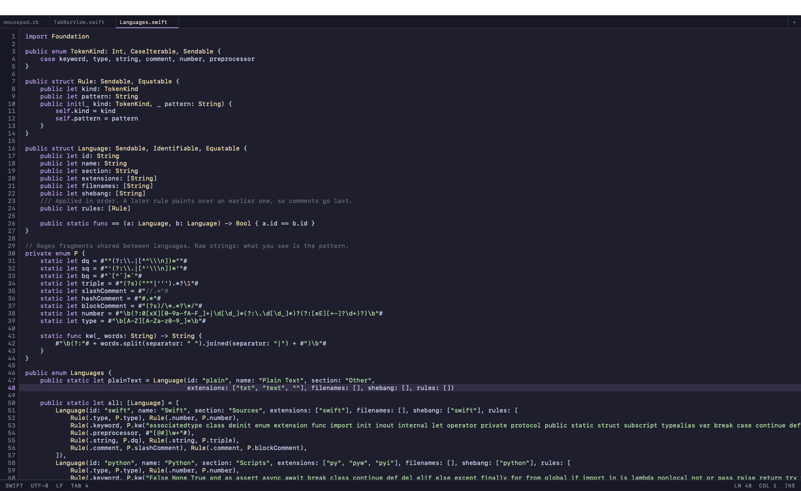

# Mousepad for macOS

A small, fast, native text editor — [Xfce's Mousepad](https://docs.xfce.org/apps/mousepad/start)
rebuilt for the Mac. Swift + AppKit, no Xcode required, no dependencies, ~3k lines.

Opens a 20 MB file in under a second, starts instantly, and stays out of your way.



## Install

```sh
brew tap code-zenx/mousepad
brew trust code-zenx/mousepad
brew install --cask mousepad
```

`brew trust` is required by Homebrew 6.0 for any third-party tap — a tap is Ruby that
Homebrew executes, so it asks you to opt in per repo. Undo with `brew untrust`.

Requires **macOS 14 (Sonoma) or newer**. The released build is Apple silicon only;
Intel Macs can build from source.

<details>
<summary>Build from source instead</summary>

```sh
git clone https://github.com/code-zenx/homebrew-mousepad.git
cd homebrew-mousepad
./Scripts/make-app.sh          # -> dist/Mousepad.app
open dist/Mousepad.app
```

Needs the Xcode command line tools (`xcode-select --install`). Nothing else.
</details>

The app is ad-hoc signed rather than notarized, so macOS will refuse to open it if it
arrives with a quarantine flag. The cask clears that flag for you. If you download the
zip by hand instead, either right-click the app and choose Open, or run:

```sh
xattr -dr com.apple.quarantine /Applications/Mousepad.app
```

## What it does

- **Tabs in one window.** A custom tab bar, not AppKit's — accent underline for the
  active tab, `*` for unsaved, `×` on hover, middle-click to close, `+` for new.
- **Syntax highlighting for 16 languages** — Swift, Python, JavaScript, TypeScript,
  Rust, Go, C/C++/Obj-C, Shell, Ruby, Markdown, HTML/XML, CSS, JSON, YAML, TOML,
  Makefile. Detected by extension, filename, or shebang; override per tab from Document ▸ Filetype.
- **Large files stay responsive.** Files over 64 KB highlight only the visible screens
  and re-highlight on scroll. Line lookups go through a chunked index rather than
  walking the string.
- **Encodings handled properly** — UTF-8/16, BOM preserved, Latin-1 and friends,
  LF/CRLF/CR round-tripped rather than silently normalised.
- **Line number gutter, current-line highlight, bracket matching, right margin ruler.**
- **Status bar** showing language, encoding, line ending, tab width, cursor position,
  and insert/overwrite mode.
- **Four themes** — Catppuccin Mocha (default), terminal, grey, and paper (light).
- **Editing commands** Xfce Mousepad has and TextEdit doesn't: duplicate line, move
  line up/down, indent/unindent selection, transpose, smart Home, paste history.

## Keyboard shortcuts

Cmd unless noted.

| | | | |
|---|---|---|---|
| New | `N` | Find | `F` |
| Open | `O` | Find next / previous | `G` / `⇧G` |
| Save | `S` | Replace | `R` |
| Save As | `⇧S` | Go to line | `L` |
| Close tab | `W` | Duplicate line | `D` |
| Close window | `⇧W` | Indent / unindent | `]` / `[` |
| Print | `P` | Move line up / down | `⌃⌘↑` / `⌃⌘↓` |
| Preferences | `,` | Transpose | `⌃T` |
| Next / previous tab | `⇧]` / `⇧[` | Paste from history | `⇧V` |
| Tab 1–9 | `1`…`9` | Full screen | `⌃F` |

`Home`/`End` are smart (first non-whitespace, then column 0). `Insert` toggles overwrite.

## Settings

Preferences window is `Cmd+,`. Everything lives in UserDefaults under
`dev.siddharth.mousepad`:

```sh
defaults read dev.siddharth.mousepad
defaults write dev.siddharth.mousepad wordWrap -bool YES
```

| Key | Default | |
|---|---|---|
| `fontName` / `fontSize` | system mono, 13 | |
| `colorScheme` | `mocha` | `mocha`, `terminal`, `grey`, `paper` |
| `showLineNumbers` | `true` | |
| `highlightCurrentLine` | `true` | |
| `showRightMargin` / `rightMarginColumn` | `false` / `80` | |
| `wordWrap` | `false` | |
| `blockCursor` | `false` | |
| `matchBrackets` | `true` | |
| `tabWidth` / `insertSpaces` | `4` / `false` | |
| `autoIndent` / `smartHome` | `true` / `true` | |
| `statusBarVisible` | `true` | |
| `pathInTitle` | `true` | full path vs. filename in the title bar |
| `rememberWindowFrame` | `true` | |
| `defaultTabSizes` | `2,3,4,8` | offered in the status bar menu |

Any setting can be overridden for one run with an argument: `.build/debug/Mousepad -wordWrap YES file.txt`.

---

# Contributing

Bug reports, feature requests, and pull requests are all welcome. The codebase is small
on purpose — if a change makes it meaningfully bigger, it should buy something obvious.

## Getting set up

You need macOS 14+ and the command line tools. No Xcode project, no package manager,
no code generation.

```sh
git clone https://github.com/code-zenx/homebrew-mousepad.git
cd homebrew-mousepad
swift build                                # debug
.build/debug/Mousepad some/file.txt        # run it
swift run MousepadCheck                    # core self-checks
```

Run `swift run MousepadCheck` before you open a pull request. The command line tools
ship no XCTest, so the checks are plain asserts in `Tests/MousepadCheck/main.swift` —
add one there when you touch `MousepadCore`.

## How the code is laid out

`MousepadCore` is pure Foundation and holds anything testable without a window.
`Mousepad` is the AppKit layer. Keep logic in Core where you can; that's what makes it
checkable.

| Path | What |
|---|---|
| `Sources/MousepadCore/TextFile.swift` | Reading and writing: encoding detection, BOM, line endings |
| `Sources/MousepadCore/TextOps.swift` | Editing commands as pure functions (duplicate, move, indent, transpose) |
| `Sources/MousepadCore/Languages.swift` | The 16 language definitions and detection rules |
| `Sources/MousepadCore/Highlighter.swift` | Applies a language's regex rules to a range |
| `Sources/MousepadCore/LineIndex.swift` | Chunked line-start index; what makes big files fast |
| `Sources/MousepadCore/Encodings.swift` | Encoding list and names |
| `Sources/Mousepad/Document.swift` | `NSDocument` subclass, one per open file |
| `Sources/Mousepad/DocumentWindowController.swift` | One window hosting N documents; owns the tab set |
| `Sources/Mousepad/EditorPane.swift` | Per-tab text view, gutter, and highlighter |
| `Sources/Mousepad/EditorTextView.swift` | `NSTextView` subclass: key handling, overwrite mode |
| `Sources/Mousepad/TabBarView.swift` | The custom tab strip |
| `Sources/Mousepad/LineNumberRuler.swift` | Gutter |
| `Sources/Mousepad/StatusBarView.swift` | Status bar and its menus |
| `Sources/Mousepad/MainMenu.swift` | Menu bar, built in code |
| `Sources/Mousepad/Theme.swift` | The four color schemes |
| `Sources/Mousepad/Settings.swift` | Every preference: one key, one default, one type |
| `Sources/Mousepad/PreferencesWindowController.swift` | Preferences window |
| `Scripts/make-app.sh` | Builds and ad-hoc signs the `.app`; generates the icon on first run |
| `Casks/mousepad.rb` | Homebrew cask — this repo is also its own tap |
| `01-…05-*.md` | Analysis of the original, concepts, plan, checklist, UI style |

## Testing UI changes

Two dev aids exist because AppKit windows are awkward to test and screen recording
needs a permission prompt.

**Window snapshot** — writes the front window to a PDF and quits, no permission needed.
The screenshot at the top of this README was made with it:

```sh
MOUSEPAD_SNAPSHOT=/tmp/win.pdf MOUSEPAD_GOTO=48 .build/debug/Mousepad a.swift b.swift
sips -s format png -Z 1600 /tmp/win.pdf --out /tmp/win.png
```

**Smoke run** — drives the tab flows that need a live window (switch, edit, undo, new,
close, move to new window) and exits 0 or 1:

```sh
MOUSEPAD_SMOKE=1 .build/debug/Mousepad a.txt b.txt c.txt
```

## Adding a language

Append a `Language` to `Languages.all` in `Sources/MousepadCore/Languages.swift`. Reuse
the shared regex fragments in `enum P` rather than writing new ones. Rules are applied
in order and a later rule paints over an earlier one, so comments go last. Add a
detection case to `MousepadCheck` covering the extension and, if it has one, the shebang.

## Pull requests

- One change per PR, and say what it does in the description rather than the title alone.
- `swift build` clean with no new warnings, `swift run MousepadCheck` passing.
- Match the surrounding style: Swift 5 language mode, no force-unwraps in Core,
  comments only where the *why* isn't obvious from the code.
- Commit messages follow [Conventional Commits](https://www.conventionalcommits.org)
  (`feat:`, `fix:`, `perf:`, `docs:`, `refactor:`). Body explains the reasoning; the
  subject stays under 50 characters.

## Cutting a release

```sh
./Scripts/make-app.sh
cd dist && ditto -c -k --keepParent --sequesterRsrc Mousepad.app Mousepad.zip
shasum -a 256 Mousepad.zip
```

Bump `CFBundleShortVersionString` in `Resources/Info.plist`, tag it, attach
`Mousepad.zip` to a GitHub release, then update `version` and `sha256` in
`Casks/mousepad.rb`. Verify with `brew audit --cask mousepad` and `brew style`.

## License

[MIT](LICENSE) — use it, fork it, ship it in something commercial, no permission needed.
Contributions are accepted under the same license.

This is an independent reimplementation, not a fork: it shares Xfce Mousepad's feature
set and layout but none of its code, so none of its GPL terms carry over.
